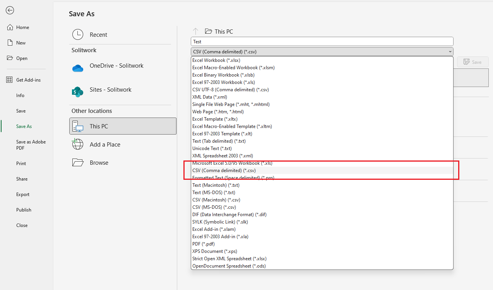
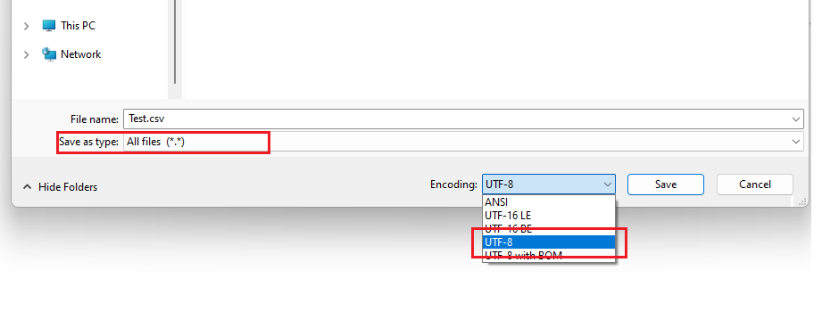
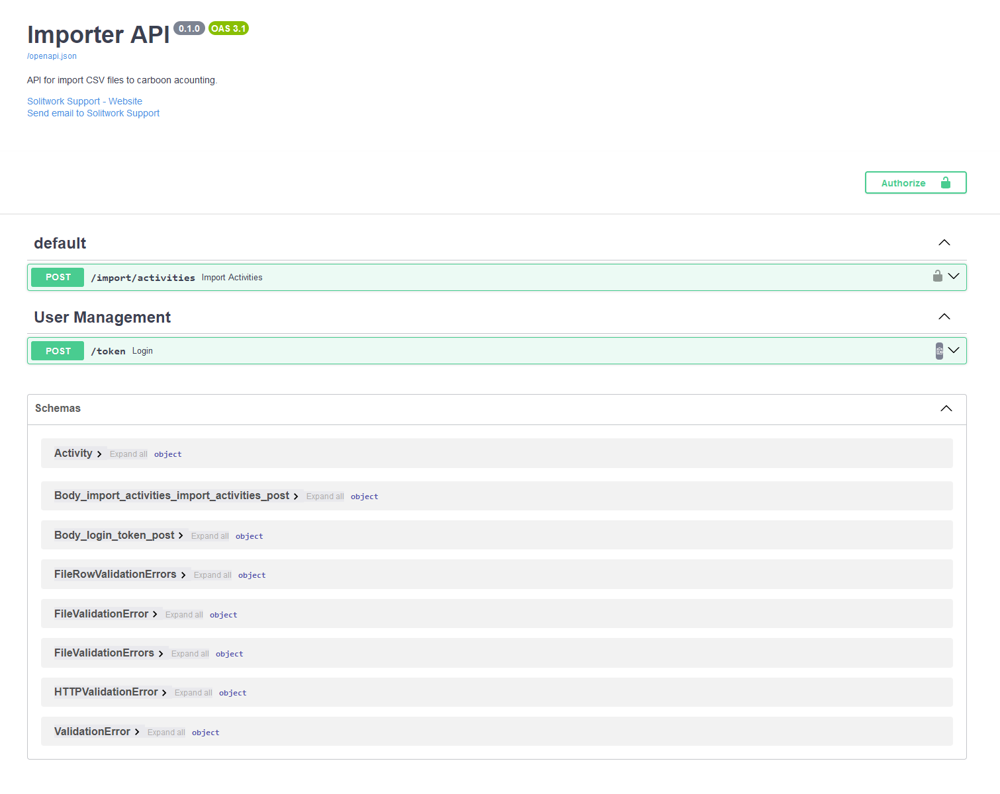
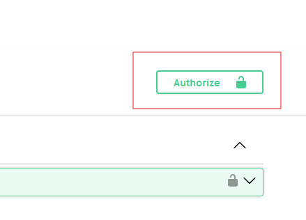
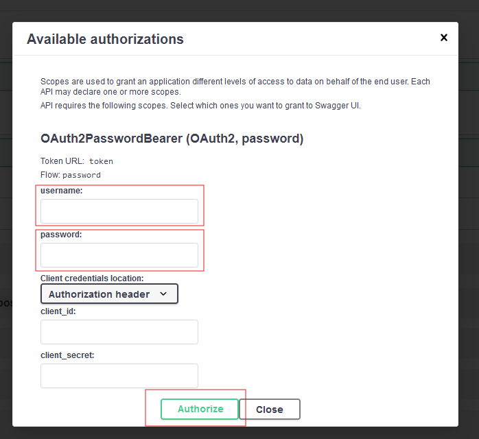
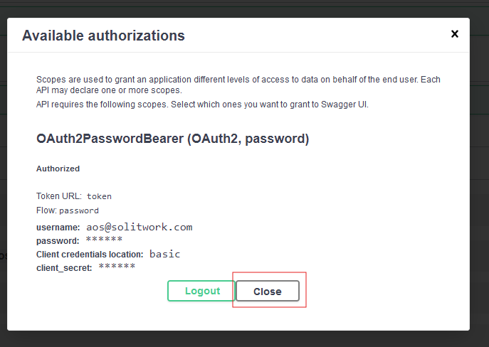
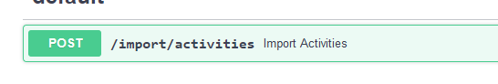
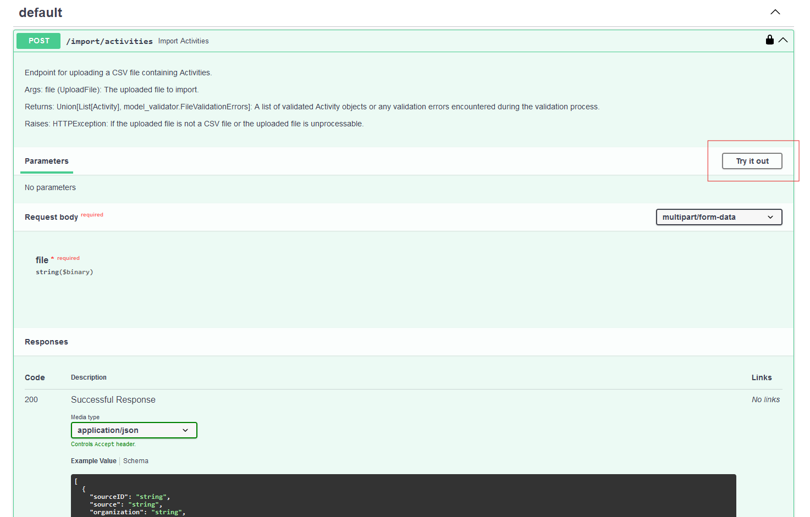
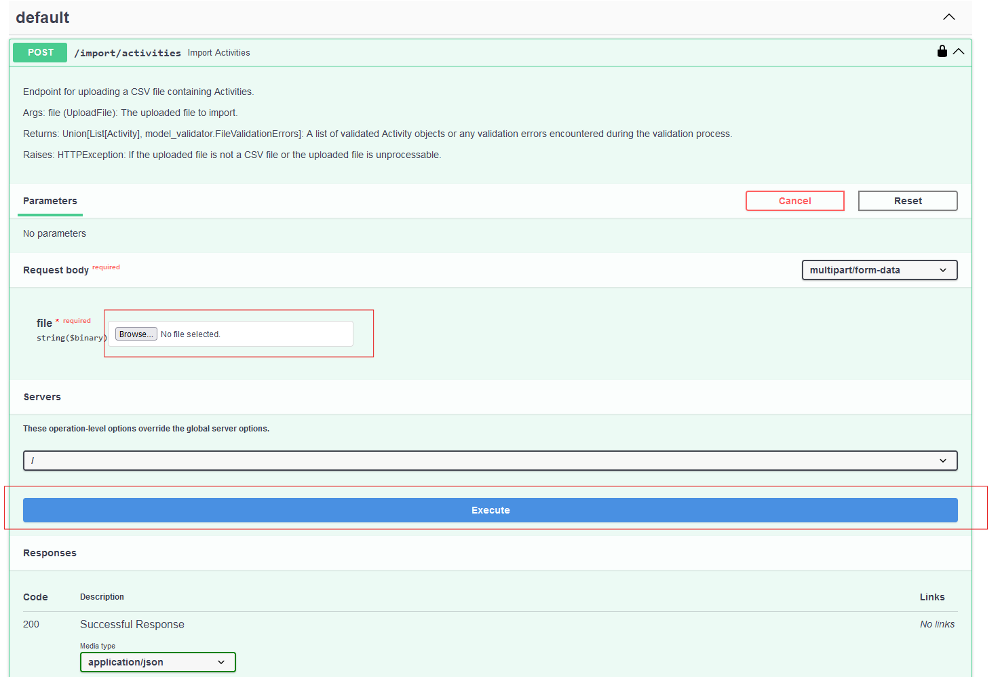
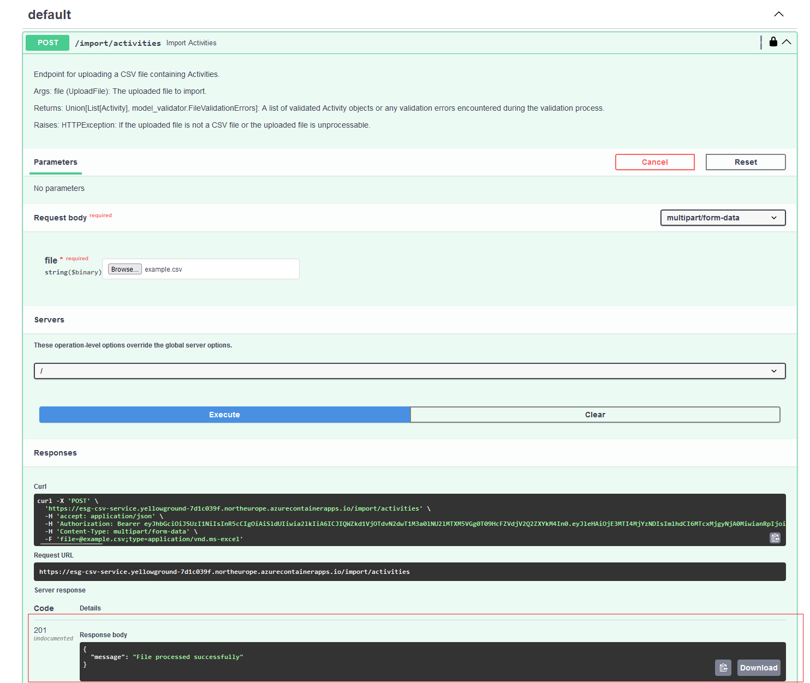

# Import ESG CSV files

This is a guide on how to import CSV files with transaction for the carbon accounting module of ESG  

# Table of content
- [CSV File format](#csv-file-format)
- [Import - Step 1. Navigate to the ESG CSV Import module](#import---step-1-navigate-to-the-esg-csv-import-module)
- [Import - Step 2. Authorize](#import---step-2-authorize)
- [Import - Step 3. Import file](#import---step-3-import-file)
- [Frequently asked questions](#frequently-asked-questions)
- [Common Issues When Preparing and Uploading CSV Files](#common-issues-when-preparing-and-uploading-csv-files)


## CSV File format

Its possible to upload csv files that adhere to the following specifications:

    Encoding: UTF-8
    Delimiter: Comma (,)
    Quote Character: Double quotes (")
    Record Format: Each record is on a new line.
    Fields:
        sourceID (string): A unique identifier for the transaction.
        source (string): Name or ID of the source system.
        organization (string): Name or ID of the organization.
        vendor (string, optional): Name or ID of the vendor. This field can be empty.
        unit (string): The unit of measure, e.g., "DKK".
        amount (decimal): Numeric value representing the amount ("." as decimal sign).
        activityDate (date in YYYY-MM-DD format): Date of the activity.
        category (string): Category of the item (typically account for financial transactions).
        comments (string, optional): Any additional comments. This field can be empty.
        department (string, optional): Name of the department. This field can be empty.
        customAttribute1 through customAttribute5 (strings, optional): Custom attributes for additional data. These fields can be empty.

Example:
```
"sourceID","source","organization","vendor","unit","amount","activityDate","category","comments","department","customAttribute1","customAttribute2","customAttribute3","customAttribute4","customAttribute5"
"123456","source-system","Company A",,"DKK","1234.5","2022-11-01","Some Category",,,,,,,
```

### How to save an Excel spreadsheet as a csv file:
To ensure your Excel file is saved in the right format:

1. **Save your Excel file as CSV (Comma delimited).**

   
3. **To ensure the CSV file is using the correct UTF-8 encoding (as different versions of Excel may use different encodings by default), please follow these steps:**
   - Open the saved CSV file in Notepad.
   - In Notepad, click on `File` -> `Save As`.
   - In the `Save as type` dropdown, select `All Files`.
   - In the `Encoding` dropdown, select `UTF-8`.

     

   - Save the file.

An example file is available here: [example.csv](example.csv)


## Import - Step 1. Navigate to the ESG CSV Import module

To access the csv import module, open to the following url in your browser:  
`https://esg-csv-service.<APPLICATION-BASE-URL>/docs`
 where `<APPLICATION-BASE-URL>` is unique for your application deployment.

You should see an application like this:



## Import - Step 2. Authorize

In order to import CSV files, you need to log in.  
You can log in using the "Authorize" button in the top right corner:  


After clicking the "Authorize" button, a windows will appear where you need to fill in your username and password and click authorize.  


If successfull, you should see a windows like this:  
  
You are now logged in and can now click "Close"


## Import - Step 3. Import file

Open the import activities pane:  


Click the "Try it out" button:  



Click "Browse" and choose the csv file to upload, and then click "Execute" to upload the csv file  


If the file was uploaded successfully, you will get the following response  
```json
{
  "message": "File processed successfully"
}
```
If there were errors when importing the file, you will also be notified here.  


## Frequently asked questions

### Q: Can I change the format of the CSV file?
**A:** No, its not possible to upload in any other format than the one specified

### Q: What happens if I upload a file containing transactions with already existing ID's?
**A:** The file will be uploaded and will not generate an error. The transactions with the already existing ID's will not be uploaded or changed in any way. The reason for allowing files with existing ID's is to ease the work done when extracting data from other systems, so that you do not need to check if the file includes data already imported.

## Common issues when preparing and uploading CSV files

### Errors in headers
**Correct Spelling and Capitalization**

Ensure that all header names match the required format exactly, including capitalization and spacing. Even a minor deviation, such as an extra space or incorrect capitalization, will prevent the file from uploading.

**Double-Check Headers**

Before uploading, carefully review all headers to ensure accuracy.

### Data formatting in Excel
**Follow Correct Data Formats – Common Mistakes**

Cells should not be formatted as general.

**Dates must follow the format: yyyy-mm-dd.**

If you are using commas in data values (e.g., in the Amount column as a thousand separator) make sure to enclose those entries with double quotes ("). Commas in entries will interfere with the CSV structure and cause errors during upload.

### Converting excel-file to CSV
**Delimiter Issues**

 When saving Excel files as CSV, some systems default to using a semicolon (;) as the delimiter instead of a comma (,). Our system expects a comma.
   
**Solution**

Open the CSV file in Notepad, press Ctrl + F to find all semicolons, and replace them with commas.

### File encoding:
**Files must be saved in UTF-8 format, not UTF-8 with BOM.**

Open the file in Notepad, save it with the encoding option set to "UTF-8."

### Hidden characters:
**Some Excel versions may introduce hidden characters during the conversion to CSV.**

Use a tool like Notepad++ to visualize and remove any hidden characters.

### Uploading the CSV file
**Authorization**

Ensure you are authorized to upload the file before proceeding. Authorization expires quickly, so complete the upload promptly after authorization.

**File Verification**

Double-check the CSV file for formatting issues before uploading.
