# SMTP Guide

This is a guide on how to create a compatible SMTP setup. By the end of the guide you should obtain the necessary stmp credentials (username, password, email, smtp server, and port)


# Table of Contents
- [SMTP Guide](#smtp-guide)
- [Table of Contents](#table-of-contents)
- [Part 1: Creating Email Communication Service Resource](#part-1-creating-email-communication-service-resource)
  - [Part 1: Creating Email Communication Service Resource](#part-1-creating-email-communication-service-resource-1)
  - [Part 2: Setting Up Managed Domain](#part-2-setting-up-managed-domain)
  - [Part 3: Connecting a Verified Email Domain](#part-3-connecting-a-verified-email-domain)
  - [Step 4: Registering an Application with Microsoft Entra ID and Creating a Service Principal](#step-4-registering-an-application-with-microsoft-entra-id-and-creating-a-service-principal)
  - [Final Step: Using a Microsoft Entra Application with Azure Communication Services Resource for SMTP](#final-step-using-a-microsoft-entra-application-with-azure-communication-services-resource-for-smtp)
    - [Creating a Custom Email Role for the Entra Application](#creating-a-custom-email-role-for-the-entra-application)
    - [Assigning Custom Email Role to Entra Application](#assigning-custom-email-role-to-entra-application)
    - [Creating SMTP Credentials from Entra Application Information](#creating-smtp-credentials-from-entra-application-information)

# Part 1: Creating Email Communication Service Resource

## Part 1: Creating Email Communication Service Resource

1. **Open the Azure portal:** 
   - Navigate to [Azure portal](https://portal.azure.com/).

2. **Search for Email Communication Services:** 
   - In the search bar at the top, type "Email Communication Services".
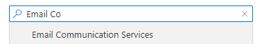
  

1. **Select Email Communication Services and press Create:** 
   - Click on "Email Communication Services" from the search results, then press the "Create" button.


2. **Select Azure Subscription and Resource Group:**
   - Choose the Azure subscription you want to use.
   - Select an existing resource group or create a new one by clicking "Create new" and providing a name.

3. **Provide Resource Details:**
   - Enter a valid name for the resource.
   - Select "Europe" as the data location.

4. **Add Tags (Optional):**
   - If necessary, add any name/value pairs for tagging purposes.

5. **Review and Create:**
   - Click on "Next: Review + create".

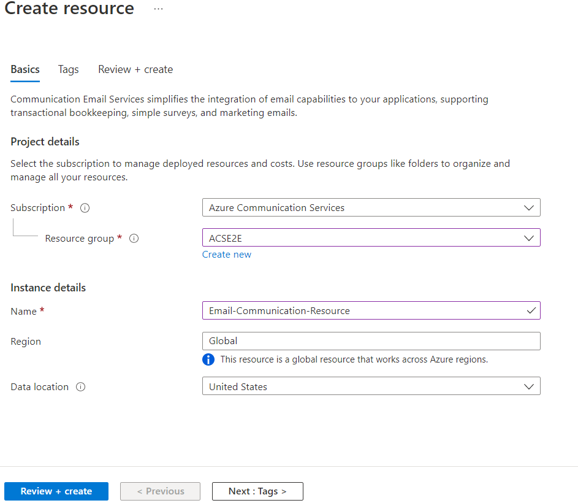


6. **Review Details and Create Resource:**
   - Review the details of your resource configuration.
   - Click "Create" to provision the Email Communication Service resource.
  
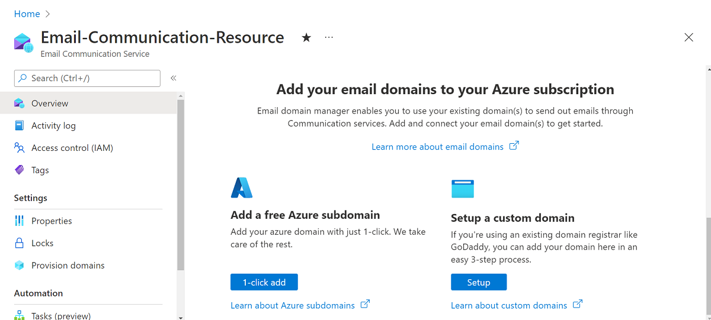


## Part 2: Setting Up Managed Domain

1. **Open the Overview page of the Email Communications Service resource:**
   - Navigate to the Overview page of the Email Communication Service resource created in the previous step.

2. **Create an Azure Managed Domain:**

   - **Option 1: Add Free Azure Subdomain**
     - Click on the "1-click add" button under "Add a free Azure subdomain".
    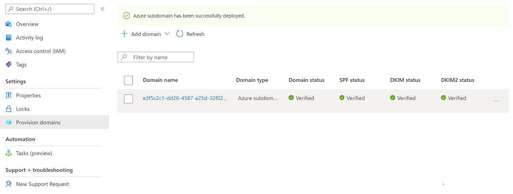


   - **Option 2: Provision Custom Domain**
     - If you prefer a custom domain, click on "Provision Domains" on the left navigation panel.
     - Click "Add domain" on the upper navigation bar.
     - Select "Azure domain" from the dropdown.
    

3. **Wait for Deployment:**
   - If you chose Option 1, wait for the deployment to complete.
    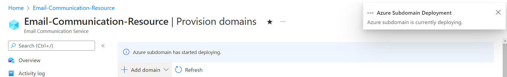

4. **View Provisioned Domain:**
   - Once the domain is created, you'll see a list view with the new domain.
    
   - Click on the name of the provisioned domain to open the overview page for the domain resource type.
    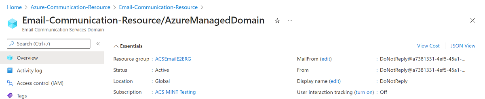


## Part 3: Connecting a Verified Email Domain

1. **Access Azure Communication Service Resource Overview:**
   - Go to the Azure Communication Service Resource overview page.
    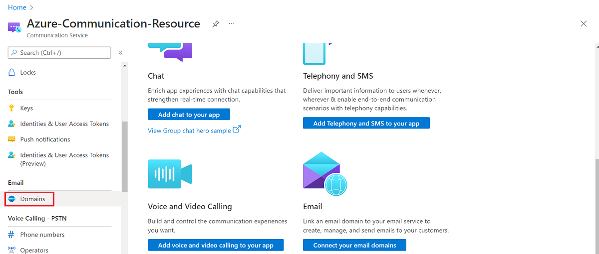

2. **Navigate to Domains:**
   - Click on "Domains" on the left navigation panel under Email.

3. **Connect Verified Email Domain:**
   - Choose one of the following options:
     - **Option 1:** Click "Connect domain" in the upper navigation bar.
     - **Option 2:** Click "Connect domain" in the splash screen.
    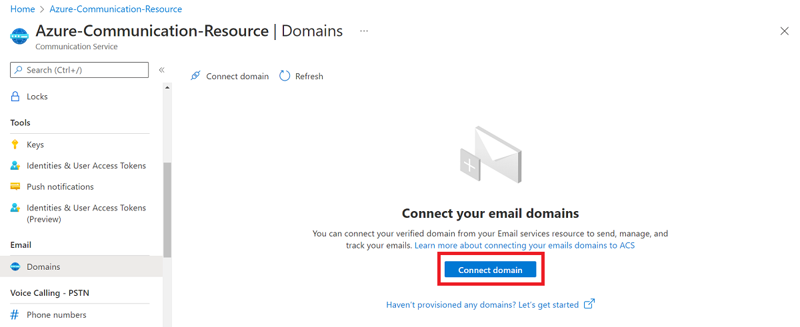
4. **Select Verified Domain:**
   - Filter and select the verified domain based on:
     - Subscription
     - Resource Group
     - Email Service
     - Verified Domain
   - If you deployed an Azure domain, you'll likely have only one option displayed.
    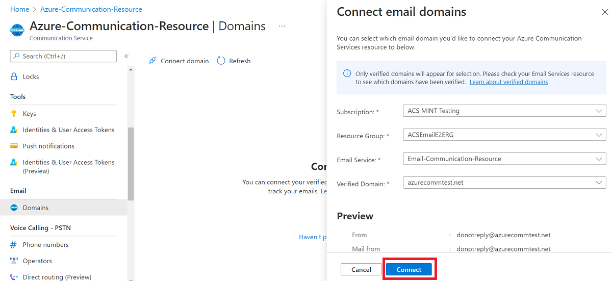
   
5. **Click Connect:**
   - After selecting the verified domain, click "Connect".
    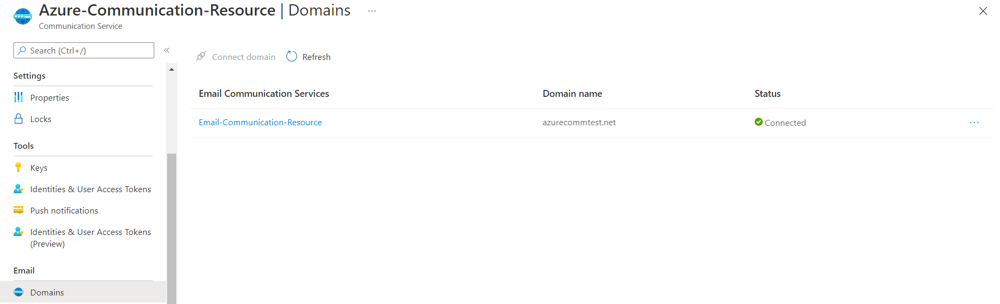

## Step 4: Registering an Application with Microsoft Entra ID and Creating a Service Principal

1. **Sign in to Microsoft Entra Admin Center:**
   - Log in as at least a Cloud Application Administrator.

2. **Navigate to Application Registration:**
   - Go to Identity > Applications > App registrations and select "New registration".

3. **Name and Configure Application:**
   - Name the application (e.g., "example-app").
   - Select a supported account type.
   - Under Redirect URI, select "Web" and enter the URI where the access token is sent.
   - Click "Register".
    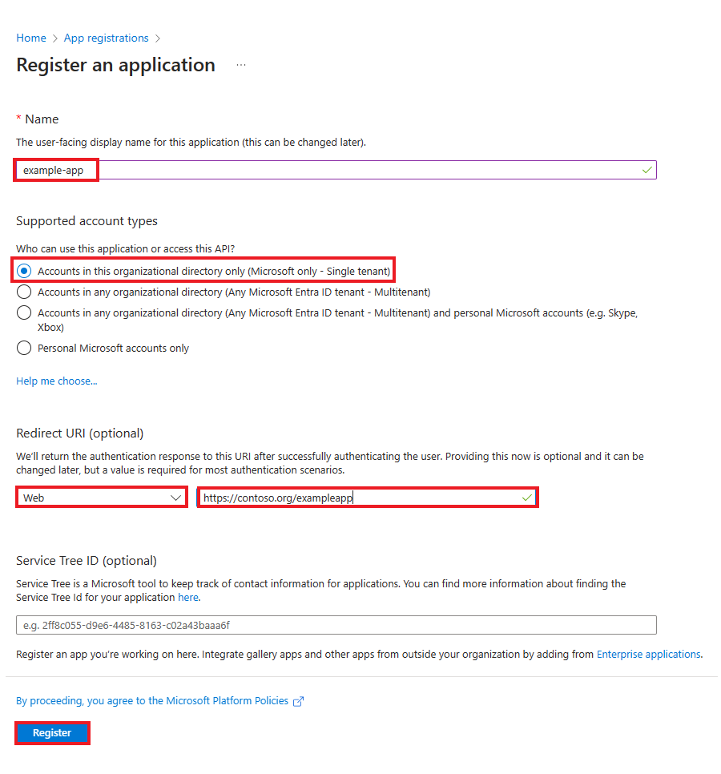

4. **Assign Role to Application:**
   - Sign in to the Azure portal.
   - Choose the scope level (e.g., subscription, resource group, or resource).
   - Navigate to Access control (IAM) and click "Add role assignment".
   - Choose the role (e.g., Contributor) and select the application as a member.
   - Click "Review + assign".
    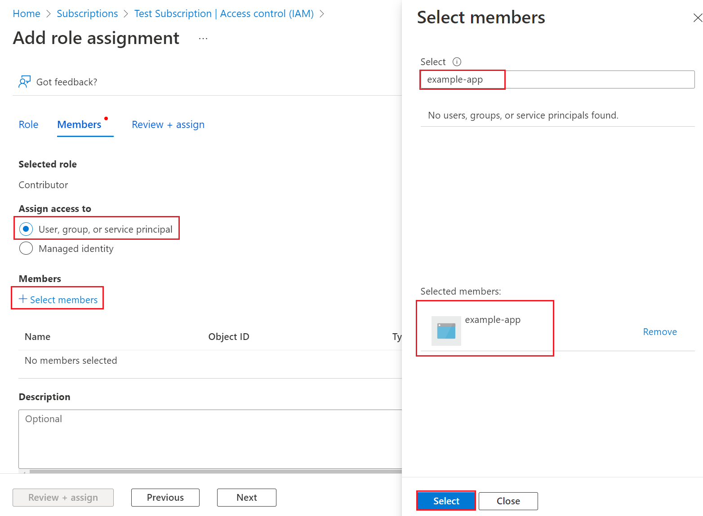

5. **Set Up Authentication for Service Principal:**

   - **Create a New Client Secret:**
     - Browse to Identity > Applications > App registrations and select your application.
     - Go to Certificates & secrets > Client secrets and click "New client secret".
     - Provide a description and duration for the secret.
     - Click "Add".
     - Copy and store the client secret securely for later use.
    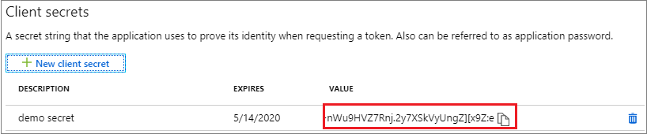


## Final Step: Using a Microsoft Entra Application with Azure Communication Services Resource for SMTP

### Creating a Custom Email Role for the Entra Application

1. **Create Custom Role:**
   - Navigate to the subscription, resource group, or Azure Communication Service Resource where the custom role should be assignable.
   - Open Access control (IAM).
     .png)
   - Click on the "Roles" tab to see a list of all built-in and custom roles.
   - Search for a role to clone (e.g., Reader).
   - Click the ellipsis (...) at the end of the row and then click "Clone".
     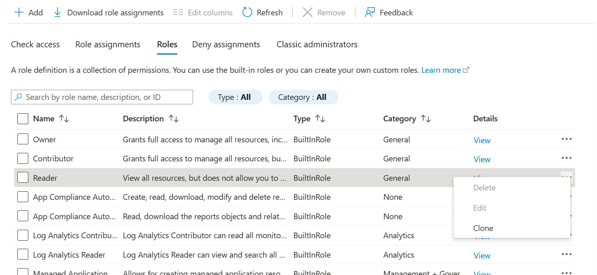

2. **Configure Custom Role:**
   - Click on the "Basics" tab and give a name to the new role.
     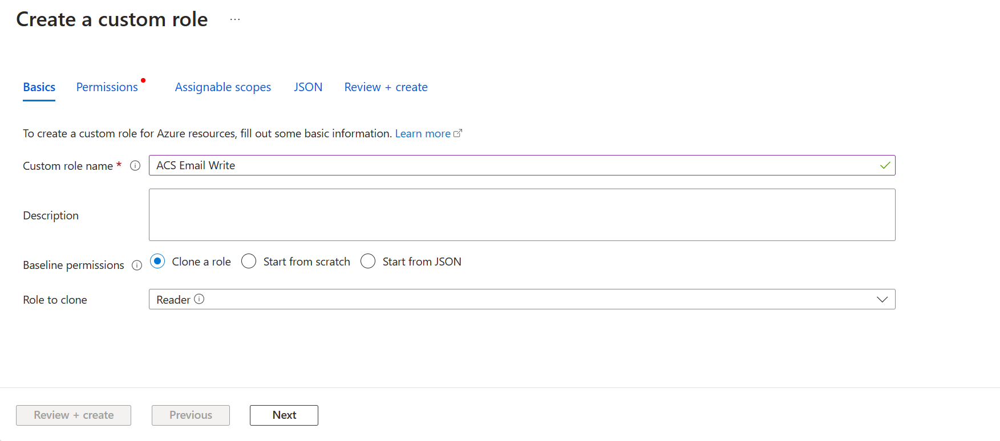
   - Go to the "Permissions" tab and click "Add permissions".
     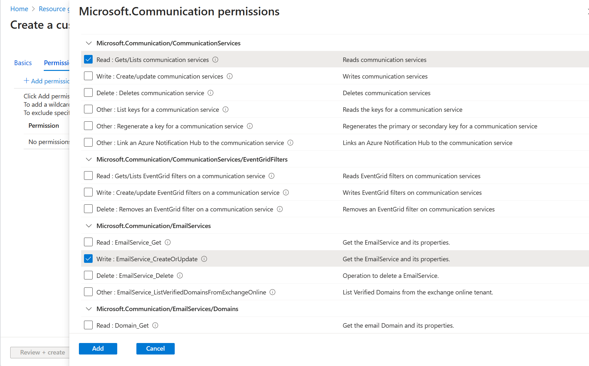
   - Search for "Microsoft.Communication" and select "Azure Communication Services".
   - Select the "Microsoft.Communication/CommunicationServices Read" and "Microsoft.Communication/EmailServices Write" permissions.
     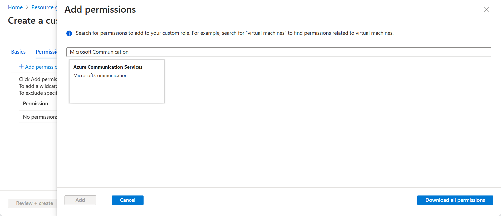
   - Click "Add".
   - Review the permissions for the new role, then click "Review + create" and subsequently "Create" on the next page.
     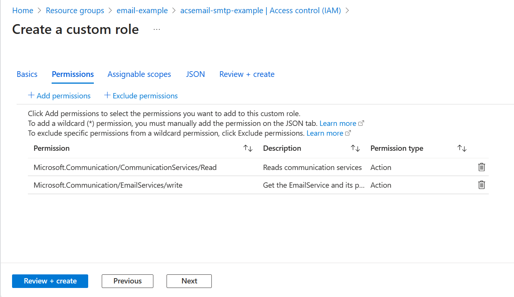

### Assigning Custom Email Role to Entra Application

1. **Assign Role:**
   - Navigate to the subscription, resource group, or Azure Communication Service Resource where the custom role should be assignable.
   - Open Access control (IAM).
     .png)
   - Click "+Add" and select "Add role assignment".
     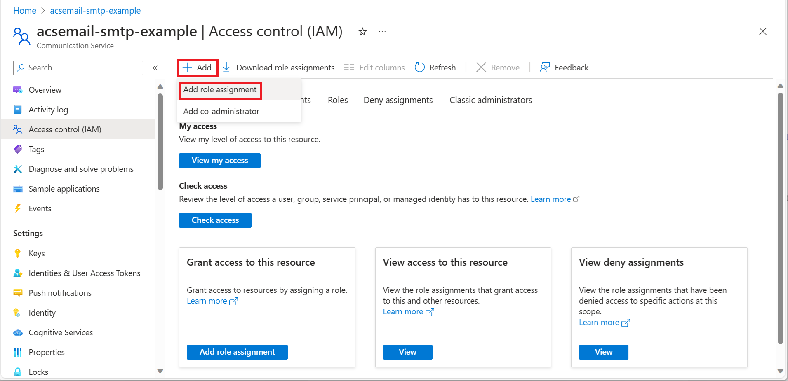

2. **Configure Role Assignment:**
   - On the Role tab, select the custom role created for sending emails using SMTP and click "Next".
     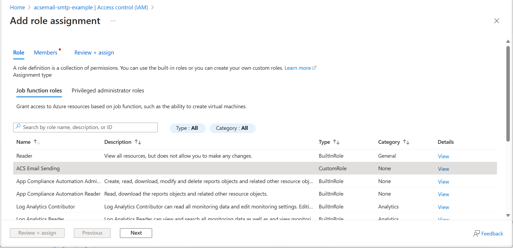
   - On the Members tab, choose "User, group, or service principal" and click "+Select members".
     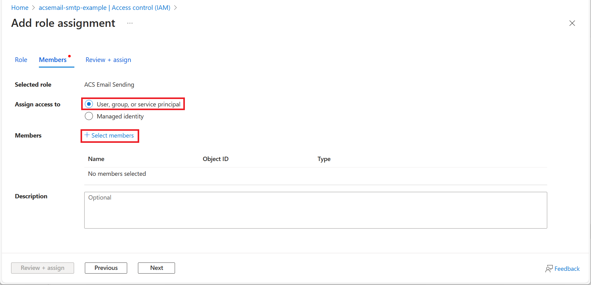
   - Search for the Entra application used for authentication and select it, then click "Select".
     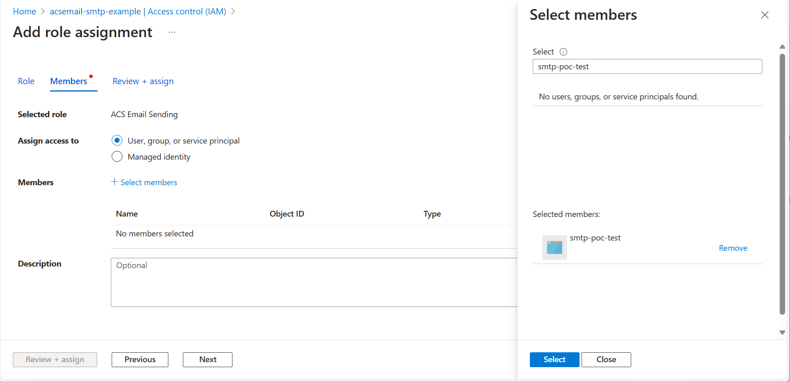
   - After confirming the selection, click "Next".
     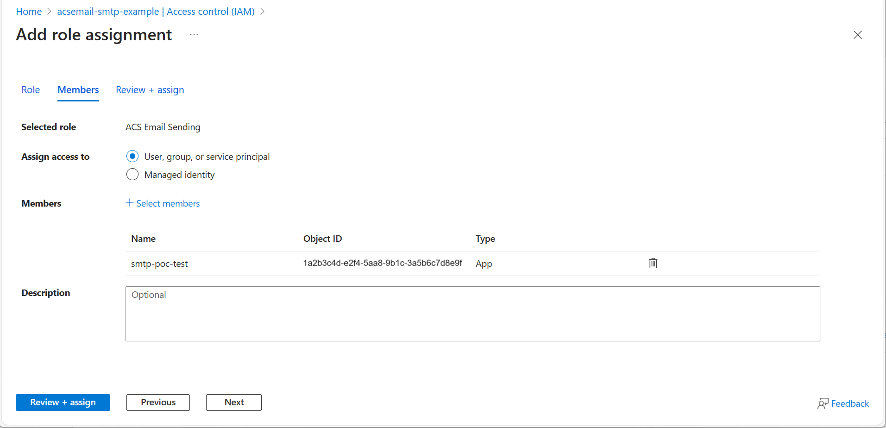
   - Confirm the scope and members, then click "Review + assign".
     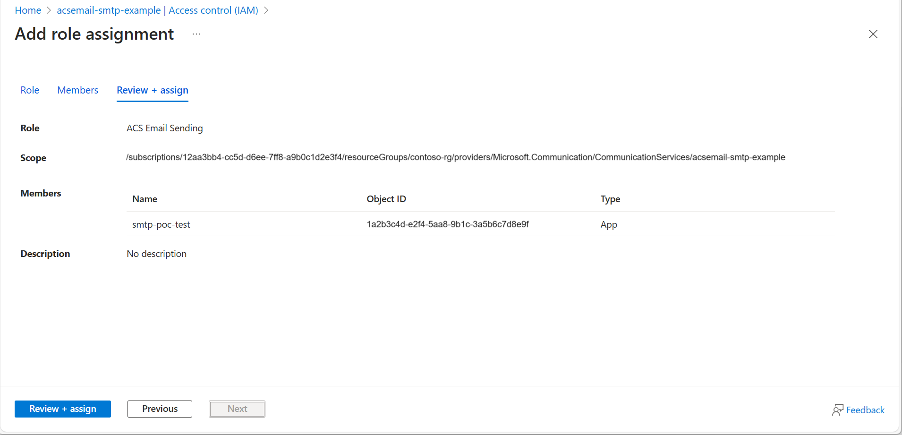

### Creating SMTP Credentials from Entra Application Information

- **SMTP Authentication Username:**
  - Construct the username using the following format:
    ```
    <Azure Communication Services Resource name>.<Entra Application ID>.<Entra Tenant ID>
    ```
  - Use the Entra Application ID and Tenant ID along with the Azure Communication Services Resource name.
  - Password: Use the secret created earlier.
    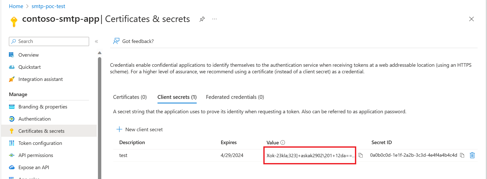

- **SMTP Server Details:**
  - **Host:** smtp.azurecomm.net
  - **Port:** 587
  - **TLS / StartTLS:** Enabled
  - **Mail_from** the email assigned to the role that manages the communication service

