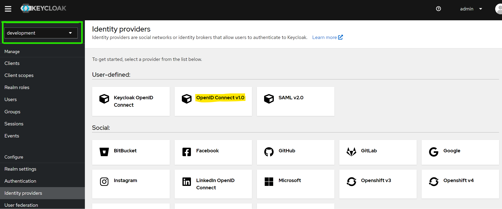
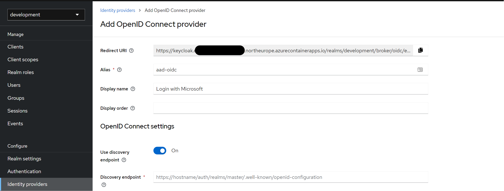
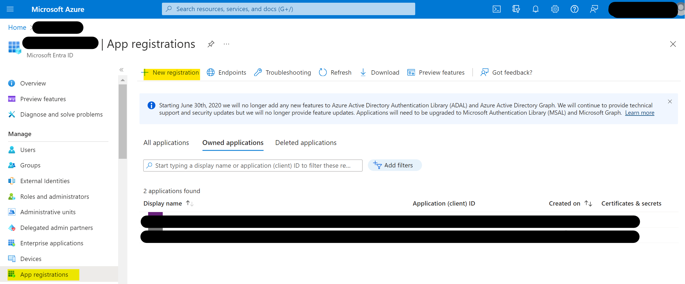
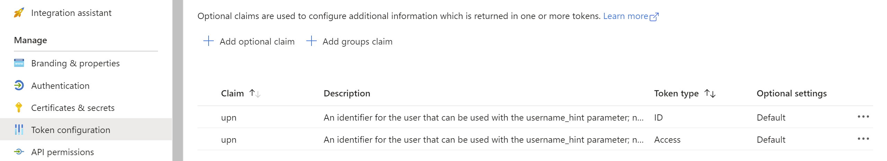
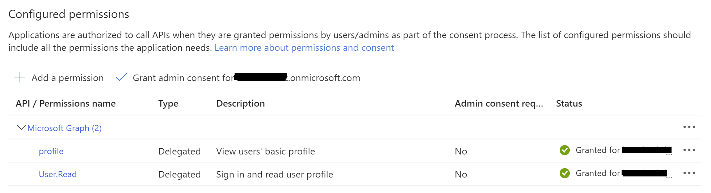
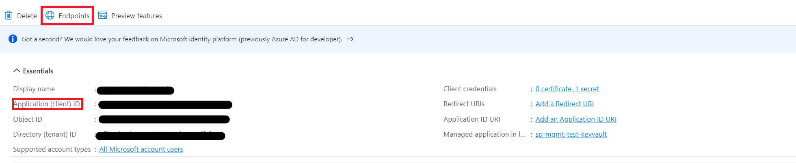
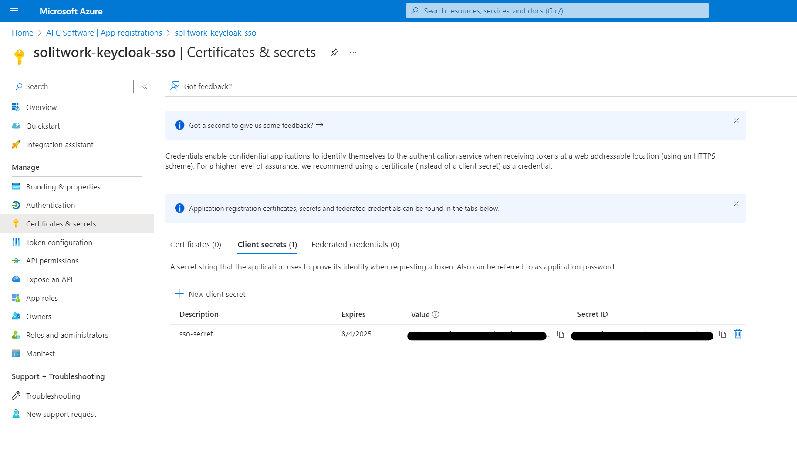
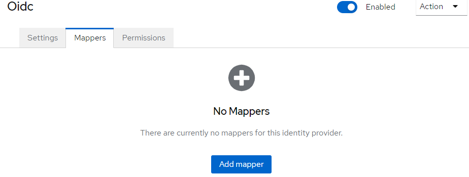

# Solitwork SSO Setup

This guide will enable the single sign on setup on your Solitwork deployed applications.

In order to ensure Azure SSO with Keycloak, we need to configure Entra ID as an identity provider, and add this identity provider in Keycloak. 

# Pre-requisites

You must have an azure account with sufficient permissions to create app registrations, security groups, and permission delegations. This can usually be done by system administrators or priviliged users.

In order to use it, Solitwork applications such as Carbon Accounting or ESG must exist in your tenant.

## Table of content
When we host the solution you'll have to go through the following steps.
- [Solitwork SSO Setup](#solitwork-sso-setup)
- [Pre-requisites](#pre-requisites)
  - [Table of content](#table-of-content)
  - [1. Keycloak Initial Setup](#1-keycloak-initial-setup)
  - [2. Microsoft Entra ID App Registration](#2-microsoft-entra-id-app-registration)
  - [3. Microsoft Entra ID User Access Control](#3-microsoft-entra-id-user-access-control)
  - [4. Endpoints and secrets](#4-endpoints-and-secrets)
  - [5. Finalize Keycloak config](#5-finalize-keycloak-config)

   
## 1. Keycloak Initial Setup

First we set up the base identity provider in Keycloak.

1. Go to the Keycloak admin center using your installation's keycloak_url.
2. Select your deployment's realm from the "Realms" dropdown menu, located top left. Your deployment name is the same as the 'customer' value in terraform.tfvars file used during installation.
3. Configure > Identity providers > OpenID Connect v1.0

4. Leave Alias as "aad-oidc"
5. Set Display Name: "Login with Microsoft"
6. Copy the Redirect URI (make sure it says ... /broker/**aad-oidc**/endpoint and **not** .../broker/**oidc**/endpoint)

## 2. Microsoft Entra ID App Registration

Now to register the application in Microsoft Entra ID. 

1. Navigate to the Microsoft Entra ID Portal for the customer in question: 
> portal.azure.com/{Customer Tenant Name}.onmicrosoft.com
2. Go to Microsoft Entra ID > App registrations > New registration

3. Choose a name: "solitwork-keycloak-sso"
4. Single tenant supported account type
5. Redirect URI: Select Web platform, and paste in redirect URI
6. Click "Register"

---

We need to configure the token to pass along the user UPN. 

1. Navigate to: Token Configuration
2. Add optional Claim 
3. Add an optional claim of type ID and Access for upn

---

We also need to grant read permission to the application. 

1. Go to API permissions
2. Grant admin consent for {customer tenant name}.onmicrosoft.com

## 3. Microsoft Entra ID User Access Control

To control which users have access to the application, we create a security group and add the appropriate members. 

1. In Microsoft Entra ID, navigate to groups
2. New group
3. Type: Security
4. Name (e.g.): solitwork-keycloak
5. Owners: Tenant admin account
6. Members: Select all users who should have access

Now we need to enable the security group for sign in.

1. Navigate to "Enterprise applications"
2. Open the application (solitwork-keycloak-sso)
3. Go to Properties
4. Ensure enabled for sign in, and enable "Assignment required"
5. Save
6. Go to "Users and groups"
7. Add user/group
8. Add the security group (solitwork-keycloak)

## 4. Endpoints and secrets

Go to App Registrations, then the 'solitwork-keycloak-sso' app. Here we need to copy some values for later use. 

1. Copy the Application (client) ID
2. Under Endpoints, copy the OpenID Connect metadata document

Furthermore we need to generate a secret for keycloak to authenticate to Azure. 

1. Go to Certificates & secrets
2. New client secret
3. Add some description, set expiry (POLICY NEEDED)
4. Copy the **Value** from the secret (see below - only visible once)

## 5. Finalize Keycloak config

Now to finalize the Keycloak identity provider. 
Go back to your previous pane with the Keycloak admin center open.

1. In "Discovery endpoint", paste the "OpenID Connect metadata document" URI.
2. In "Client ID", paste the "Application (client) ID".
3. In "Client Secret", paste the generated secret value.
4. Press "Add".
5. Press "Save".

Now we need to set up a mapping. Navigate to the "Mappers" pane.

Email:
1. Add mapper 
2. Name: "email"
3. Sync mode override: "Force"
4. Mapper type: "Attribute Importer"
5. Claim: "upn"
6. User Attribute Name: "email"
7. Press Save

